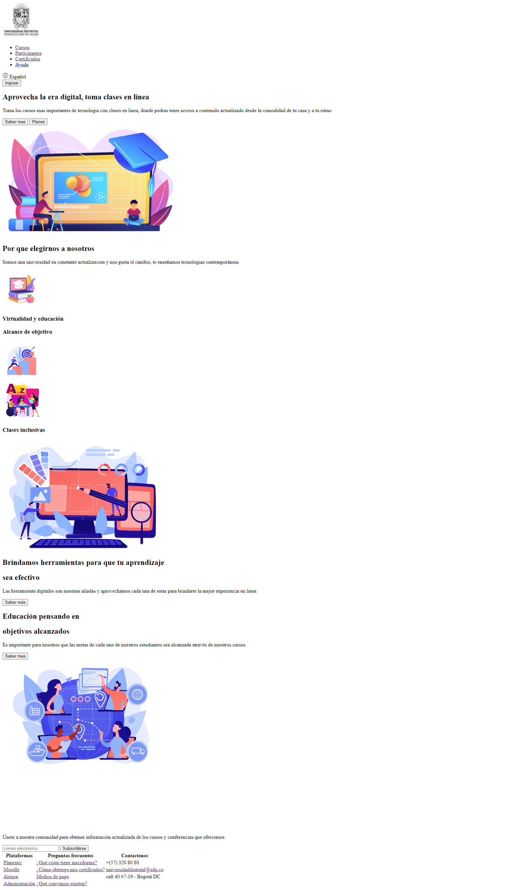

<h1>Taller 9 Juan David Garzón Díaz</h1>

<h2> Información</h2>

Curso: full Stack Basico - Grupo 1

Profesor: Cristian Patiño

<h2> Punto 1: Link figma</h2>

<a href="https://www.figma.com/file/IxI5rgHCJAx8j6tjT0nzpX/Juan-David-Garz%C3%B3n-Diaz?type=design&node-id=0%3A1&mode=design&t=0rMnFqtjSaBL9Q2H-1" target="_blank">Link de Figma</a>

<h2>Punto 2: HTML<h2>
